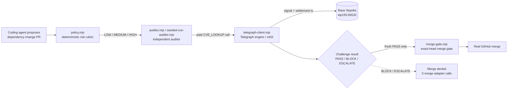

# Skeptara — Telegraph Track 3

> **No autonomous merge without an independent challenge.**

Skeptara is a pre-execution safety layer for autonomous coding agents. Before a dependency-change pull request can become execution-eligible, Skeptara applies an **external deterministic risk classification** and obtains **Telegraph-routed counter-evidence** under a bounded spend contract.

The proposing agent does **not** score its own risk and does **not** audit itself. Missing coverage, critical ambiguity, stale bindings, or material counter-evidence fail closed.

## Proof, immediately

| | PR #1 — challenged | PR #2 — clean |
| --- | --- | --- |
| Target | `lodash@4.17.20 → 4.17.21` | `lodash@4.17.20 → 4.18.1` |
| Real PR | [#1](https://github.com/Faadil1/Faadil1-skeptara-telegraph/pull/1) | [#2](https://github.com/Faadil1/Faadil1-skeptara-telegraph/pull/2) |
| Findings | `CVE-2026-2950` (blocking) | `CVE-2026-4800`, `CVE-2026-2950` (both advisory — out of range) |
| Real settlement tx | [`0x171e2fc6…`](https://sepolia.basescan.org/tx/0x171e2fc64a0d33b9726a31e3a45654aa47b2ce94b89f83d74d30fe3b327f5020) | [`0x66bd4189…`](https://sepolia.basescan.org/tx/0x66bd41892d411b9be502759fc4259d2bec8821fd818385cc5eabb950589ab2a2), [`0x95e44b46…`](https://sepolia.basescan.org/tx/0x95e44b463cb6cafd4b1c56a9889930c1180d084a5e709ccf410296ca465d1e1b) |
| Outcome | `BLOCK` — merge denied, **0** merge-adapter calls | `PASS` — real merge, commit [`c76c76e0`](https://github.com/Faadil1/Faadil1-skeptara-telegraph/commit/c76c76e0c02dab28275d8e53d70da3f6f132e648) |

Every transaction and commit above is independently verifiable on Base Sepolia / GitHub — not a UI claim. Full evidence chain: `evidence/t4/`.

## Portfolio snapshot

| | |
| --- | --- |
| **Problem** | An autonomous coding agent should not be allowed to propose a risky dependency change, assess its own risk, and then authorize its own merge. |
| **Mechanism** | External deterministic risk tier → risk-proportional paid challenge → PASS / BLOCK / ESCALATE → exact-head protected execution. |
| **Live proof** | One challenged dependency change was blocked with **0 merge-adapter calls**; one clean case passed with **2/2 Telegraph coverage** and completed a real exact-head merge. |
| **Economic boundary** | Challenge spend is bounded by policy; the verified activity subset records real testnet USDC challenge calls and observed spend. |
| **My role** | Product mechanism · risk policy · execution-gate architecture · Telegraph/x402 integration · negative-path testing · evidence/claim-boundary design. |
| **Themes** | AI-agent governance · independent challenge · fail-closed execution · software supply-chain risk · bounded paid evidence · GitHub automation. |

## Why this project matters

Autonomy becomes dangerous when the same agent can be **proposer, evaluator, and executor**.

Skeptara breaks that loop. It forces a meaningful external objection path before protected execution and binds any eventual merge to the exact reviewed head. Human authorization can add another safety boundary, but it cannot turn a `BLOCK` or `ESCALATE` into a `PASS`.

## How it works



Every node above is a real file in `src/`; every arrow is a real call path exercised in the T4 proof below — not a planned or conceptual architecture.

```text
agent proposes change
→ external deterministic risk classification
→ risk-proportional independent challenge
→ PASS / BLOCK / ESCALATE
→ exact-head revalidation
→ protected execution only if still eligible
```

Risk controls scrutiny:

| Tier | Required paths | Demo cap | Evidence status |
| --- | ---: | ---: | --- |
| LOW | 1 | 10,000 atomic USDC | deterministic policy/test-proven |
| MEDIUM | 2 | 20,000 atomic USDC | **live-proven in final T4 cases** |
| HIGH | 3 | 30,000 atomic USDC | deterministic policy/test-proven |

The caps above are Skeptara demo parameters derived from observed testnet pricing. They are **not** a claim that Telegraph pricing is fixed network-wide.

## What was proven live

### Challenged PR #1 — BLOCK → no merge call

- target: `lodash@4.17.21`
- risk: `MEDIUM`
- both required Telegraph `CVE_LOOKUP` calls ran, spending the full `$0.02` cap:
  1. `CVE-2026-4800` → `AMBIGUOUS`, did not count toward coverage
  2. `CVE-2026-2950` → `BLOCKING`, affects `lodash <4.18.0`
- result: `BLOCK` (`completed_coverage: 1/2` — one path counted as material, not that only one call happened)
- protected merge authorization: `DENIED`
- merge-adapter calls: `0`

Evidence:

- `evidence/t4/pr1-block-run-004/REVIEW.md`
- `evidence/t4/pr1-block-run-004/MERGE-DENIAL-REPLAY.md`
- `evidence/trace/FRONTEND-SETTLEMENT-MATRIX-CLARIFICATION.md` — verified settlement transaction for both calls

### Clean PR #2 — PASS → exact-head real merge

- target: `lodash@4.18.1`
- risk: `MEDIUM`
- real Telegraph coverage: `2/2`
- routed miners observed: PREFLIGHT Infrastructure Signals (`20260828`) + SecWire CVE Lookup (`7336`)
- observed challenge spend: `$0.02` testnet USDC
- result: `PASS`
- exact head revalidated before execution
- explicit bounded human authorization used as an additional real-write safety boundary
- real merge commit: `c76c76e0c02dab28275d8e53d70da3f6f132e648`

Evidence:

- `evidence/t4/pr2-clean-run-005/REVIEW.md`
- `evidence/t4/pr2-clean-run-005/reviewed-challenge.sanitized.json`
- `evidence/t4/pr2-clean-run-005/REAL-MERGE-EXECUTION.md`

## Why Telegraph matters

Skeptara does not hardcode a single intelligence provider. It declares an evidence need and sends paid demand through Telegraph's engine. The final clean challenge observed two different routed miners in one `CVE_LOOKUP` challenge. x402 keeps each evidence path economically bounded and observable.

The product-level innovation is the **risk-proportional objection policy + exact execution gate**, not x402 by itself.

## What I owned

- defined the product mechanism around independent challenge before protected autonomous execution;
- separated proposer behavior from deterministic risk authority;
- designed the risk-proportional scrutiny policy and fail-closed outcomes;
- integrated Telegraph-routed evidence and bounded x402 spend into the challenge path;
- bound execution eligibility to the exact reviewed PR head;
- built negative-path and clean-path evidence showing both denied and permitted execution;
- documented claim boundaries so the project does not overstate what the live proof demonstrates.

## Run the demo

Secret-free captured-live replay:

```bash
npm run demo
```

This command performs **no Telegraph payment and no GitHub write**. It replays persisted live evidence and explicitly labels it as historical.

Local static challenge-dossier UI:

```bash
npm run demo:web
```

Then open `http://127.0.0.1:4173`.

Full Vite + React + TypeScript judge UI (richer, componentized version of the same judge path):

```bash
cd web && npm install && npm run dev
```

**Live:** https://skeptara.vercel.app — see `docs/DESIGN.md` for its visual system and `demo/JUDGE_WALKTHROUGH.md` for a judge-facing walkthrough with screenshots.

## Testing

Deterministic policy/auditor/merge-gate suites run without any paid Telegraph call:

```bash
npm test               # all suites
npm run test:policy    # risk rubric
npm run test:auditor   # independent auditor
npm run test:merge-gate # fail-closed merge gate
```

## Verified activity subset

The conservative final-proof ledger currently includes:

- 3 real paid challenge runs;
- 5 real paid Telegraph evidence calls;
- 2 observed routed miners;
- `$0.05` observed testnet USDC spend;
- 1 protected challenged action denied;
- 1 real exact-head merge.

See `evidence/activity/ACTIVITY-LEDGER-V0.1.md`. (Note: the landing page's `$0.04` / `4 calls` stat is scoped to the two **final T4 cases** only, not this broader ledger — the two numbers describe different, both-real subsets.)

## Real vs. mock (web/ frontend)

Every field the `web/` frontend renders comes from `docs/FRONTEND_DATA_CONTRACT.md` and is sourced from the same two **real, closed** T4 challenge runs documented above — not a live stream, not simulated:

- **PR [#1](https://github.com/Faadil1/Faadil1-skeptara-telegraph/pull/1) (challenged, `BLOCK`)** — both real Telegraph `CVE_LOOKUP` calls shown in their actual order, both with real settlement transactions verifiable on Base Sepolia (`0x07ef1d9a…`, `0x171e2fc6…`). Merge denied, 0 merge-adapter calls made.
- **PR [#2](https://github.com/Faadil1/Faadil1-skeptara-telegraph/pull/2) (clean, `PASS`)** — both real Telegraph calls, both with real settlement transactions (`0x66bd4189…`, `0x95e44b46…`), both advisory (non-blocking) findings. Real merge executed under explicit human-bounded authorization, commit [`c76c76e`](https://github.com/Faadil1/Faadil1-skeptara-telegraph/commit/c76c76e0c02dab28275d8e53d70da3f6f132e648).

All four evidence rows across both cases are independently verifiable — four separate paid calls, four separate on-chain transactions, never one hash reused across rows.

The `web/` frontend replays these two closed runs with paced loading states for legibility (each case page moves through `assessing risk → challenging → verdict` on load) — this is a **replay of recorded evidence**, labeled as such in the UI with a `replay` control, never presented as a live call in progress.

Per the PRD (`product/PRD.md` §"No placeholders"), no submission intelligence is mocked in `web/`: no fabricated hash, cost, miner, or finding appears anywhere in the UI. When a contract field is null or missing, the UI shows an explicit fallback (e.g. "not exposed", "none flagged") rather than inventing a value. The only synthetic case ever created — a null/edge-field stress fixture used during frontend quality testing — was local-only and removed before this build; the repository history and this README are the record of that.

Neither of the two final T4 cases resolved to `ESCALATE` — earlier development runs did exercise it, but they aren't part of this two-case demo. The `web/` landing page states this directly instead of fabricating a third ESCALATE case to look complete.

## Important claim boundaries

- The final hackathon proof uses **controlled exact CVE seeds** to obtain concrete advisory/range records. It proves challenge enforcement, not automatic discovery of unknown vulnerabilities.
- "Independent challenge" refers to proposer/auditor topology and deterministic external policy. It does **not** claim statistical independence between miners.
- LOW/HIGH scaling is policy/test-proven; the final real paid two-case proof is MEDIUM.
- Historical replays do not create fresh execution authorization.
- T3 proves the protected merge contract and exact-head forwarding in code/tests; T4 proves a real exact-head merge under the same constraints. This repo does not claim a fully deployed production GitHub App/runtime adapter.
- Human authorization was an extra safety boundary for the real demo write. It could not convert `BLOCK` or `ESCALATE` into `PASS`.

See `docs/JUDGE-CLAIM-BOUNDARIES.md`.

## Project sources

- Living product source: `product/PRD.md`
- Canonical state: `state/CURRENT.yaml`
- Conversation/runtime handover: `state/HANDOVER.yaml`
- Derived execution artifacts: `spec-kit/`
- Architecture/decisions/contracts: `docs/`
- Evidence index: `evidence/README.md`
- Winning Intelligence: `evidence/winning-intelligence/`

## Administrative status

- Telegraph registration: **VERIFIED**
- Official Discord: **human join/activity verification still required**
- X showcase/update(s): **human publishing/verification still required**
- Final submission: **not yet submitted**

See `docs/SUBMISSION-COMPLIANCE.md`.

## Safety

- No private keys or payment secrets in browser code, commits, issues, or durable evidence.
- Telegraph/x402 wallet material stays local/server-side only.
- No protected GitHub write credential is exposed to the frontend.
- No artificial user, request, engagement, or adoption metrics.

## Current gate

See `state/CURRENT.yaml` for the exact authoritative next gate. Repository truth outranks chat memory.
