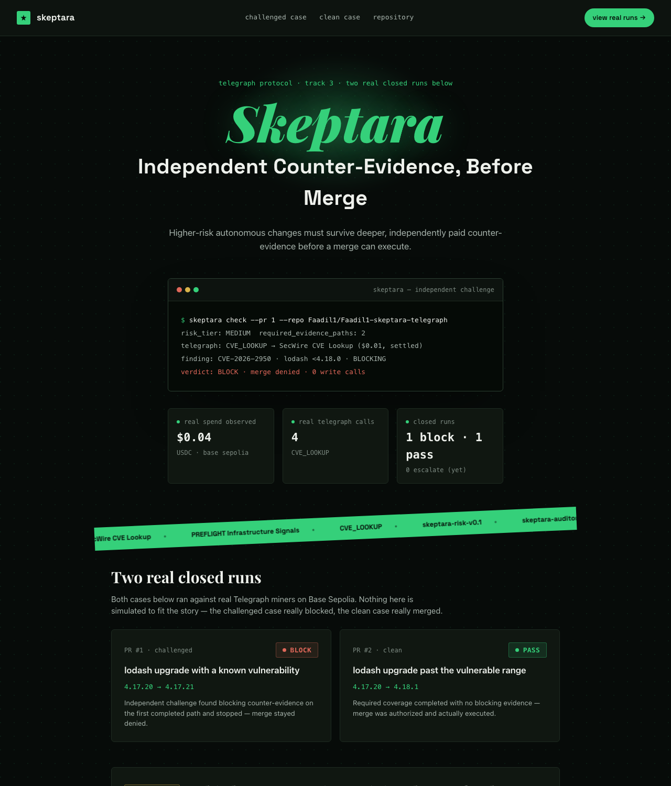
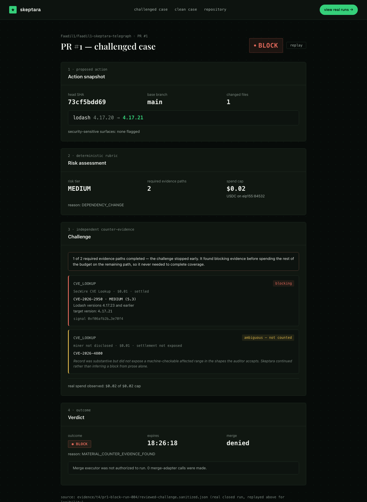
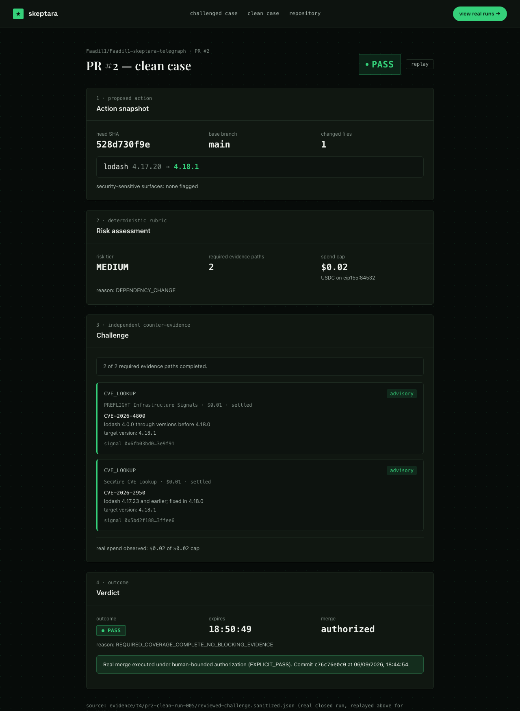

# Skeptara — Judge Walkthrough

Two real, closed Telegraph challenge runs. No step below is simulated to fit the story.

## The one-sentence claim

Higher-risk autonomous code changes must survive deeper, independently paid counter-evidence
— acquired from real Telegraph miners on Base Sepolia — before a merge can execute.

## Start here

Live: **https://skeptara.vercel.app** — or run locally with `npm install && npm run dev` from `web/`. Landing page:

The hero shows a real command resolving to a real verdict. The stat row underneath is not
decorative — `$0.04` real spend, `4` real Telegraph calls, `1 block · 1 pass` are computed
live from the two closed runs below, not hardcoded.

## Case 1 — the challenged PR (real BLOCK)

**[Faadil1/Faadil1-skeptara-telegraph#1](https://github.com/Faadil1/Faadil1-skeptara-telegraph/pull/1)**
proposes `lodash 4.17.20 → 4.17.21`.

1. **Action snapshot** — the exact PR, head SHA, and dependency change Skeptara reviewed.
2. **Risk assessment** — the deterministic rubric assigns `MEDIUM` (dependency change),
   requiring 2 independent evidence paths, capped at `$0.02`.
3. **Challenge** — the independent auditor makes two paid calls to Telegraph's `CVE_LOOKUP`
   intent, spending the full `$0.02` cap. The first (`CVE-2026-4800`, SecWire CVE Lookup) comes
   back real but ambiguous — the auditor can't derive a machine-checkable version range from it,
   so it doesn't count toward coverage. The second (`CVE-2026-2950`, same miner) returns an
   exact match: affects `lodash <4.18.0`, and the proposed target `4.17.21` falls inside that
   range — **blocking** materiality. `1 of 2` required paths completed means one of the two paid
   calls produced material coverage, not that only one call happened.
4. **Verdict** — `BLOCK`, reason `MATERIAL_COUNTER_EVIDENCE_FOUND`. Merge: **denied**,
   0 merge-adapter calls made — the merge executor never ran.

Source: `evidence/t4/pr1-block-run-004/reviewed-challenge.sanitized.json`

## Case 2 — the clean PR (real PASS, real merge)

**[Faadil1/Faadil1-skeptara-telegraph#2](https://github.com/Faadil1/Faadil1-skeptara-telegraph/pull/2)**
proposes `lodash 4.17.20 → 4.18.1` — past the vulnerable range.

1. Same rubric, same `MEDIUM` tier, same `$0.02` cap, same 2 required paths.
2. Both real Telegraph lookups return real records (`PREFLIGHT Infrastructure Signals` and
   `SecWire CVE Lookup`, real signal hashes, real $0.01 settlements each), but neither's
   affected range covers `4.18.1` — both are `ADVISORY`, not blocking. Coverage completes
   2 of 2.
3. **Verdict**: `PASS`, reason `REQUIRED_COVERAGE_COMPLETE_NO_BLOCKING_EVIDENCE`.
4. **Merge**: a real merge was executed under explicit human-bounded authorization, bound to
   the exact reviewed head SHA. Commit
   [`c76c76e`](https://github.com/Faadil1/Faadil1-skeptara-telegraph/commit/c76c76e0c02dab28275d8e53d70da3f6f132e648)
   is real and inspectable.

Source: `evidence/t4/pr2-clean-run-005/reviewed-challenge.sanitized.json`

## The third state, honestly

A real Skeptara run can also resolve to `ESCALATE` — required coverage incomplete, a source
unavailable, or a critical finding too ambiguous to resolve. Neither of these two final T4
cases hit it, though earlier development runs did exercise it. The landing page says so
directly rather than fabricating a third case card to look complete.

## What to check as a skeptical judge

- Every number on screen traces to a file in `evidence/t4/` — open them next to the UI.
- PR #1 made both required paid calls (full `$0.02` spent, confirmed in
  `evidence/t4/pr1-block-run-004/REVIEW.md`) — `completed_coverage: 1` means one of the two
  counted as material, not that the second call never happened.
- Every evidence row across both cases links to its own real Base Sepolia settlement
  transaction — four separate paid calls, four separate transactions
  (`evidence/trace/FRONTEND-SETTLEMENT-MATRIX-CLARIFICATION.md`), never one hash reused
  across rows.
- The merge on PR #2 is a real GitHub commit, not a UI claim — click through to it.
- `git diff main..feat/frontend-benita -- src/ state/` is empty: nothing in this frontend
  branch touched the risk rubric, the auditor, or the merge gate.
